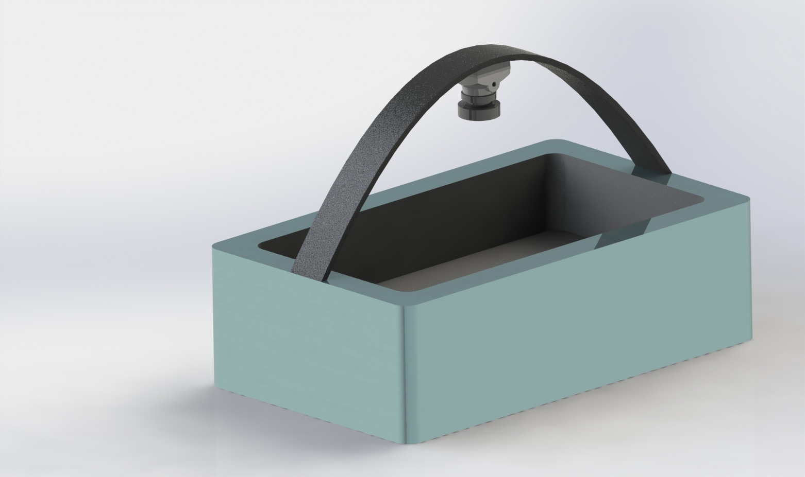

# Diet-Monitoring-System

The project aims to create a datamap of the daily food intake of an animal and analyze it's food pattern based on its daily intake and then compare it with the ideal intake of that animal's breed. This is done inorder to predict the reason behind the illness/abnormal behavior of an animal based on its recent food activity. The animal taken into consideration for our project was a cow since it was one of the most prominent domestic animals in India.

This repository stores the code required to identify the food items in the preliminary stage of the tracking process along with the working code for the Arduino which handles the energy tracking process. Since we are currently planning to develop the project further, the entire concept for the project cannot be shared here. 

### Architecture

The model is built on a standard LeNet CNN architecture with over a dataset of 1100 images.

### Project Execution

1. Open the `Terminal`.
2. Clone the repository by entering `https://github.com/pranay-ar/Diet-Monitoring-System`.
3. Ensure that `Python3` and `pip`/`conda` is installed on the system.
4. Create a `virtualenv` by executing the following command: `virtualenv -p python3 env`.
5. Activate the `env` virtual environment by executing the follwing command: `source env/bin/activate`.
6. Enter the cloned repository directory and execute `pip install -r requirements.txt`.
7. To train the model, run the `train.py` script by using the following command `python train.py --dataset <datasetpath> --model weights.model` 
8. For visualising the result of the trained model, execute the following command: `python test.py --model weights.model \` and it will ask for the image location you want to test the model on.
9. Enter the image location as follows: `--image <location>` and the model will display the results.

### Proposed Design of the Product

